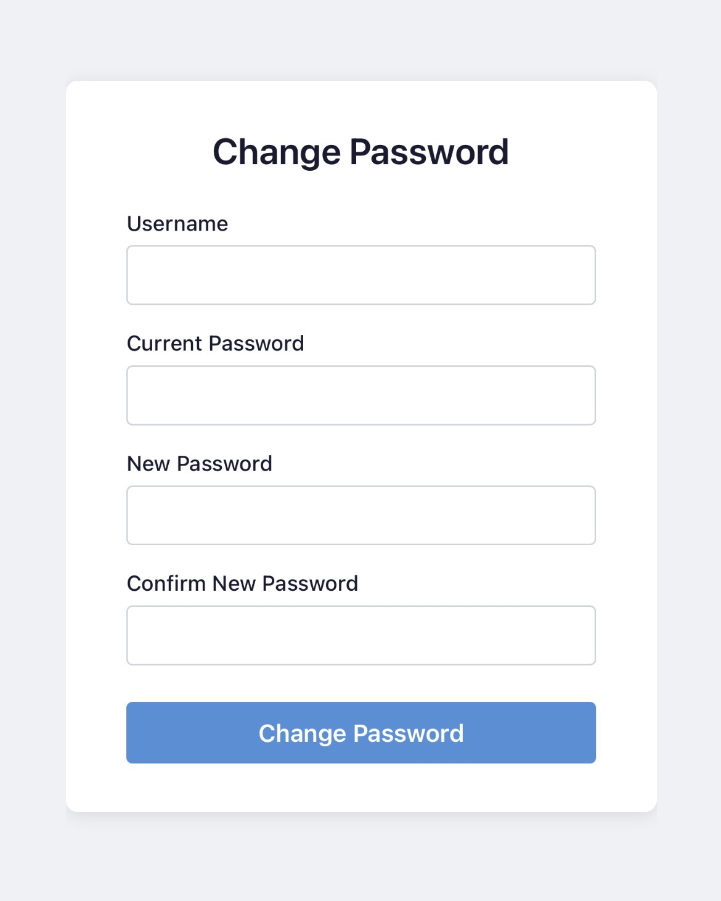

# webpasswd
A simple web app to change your own local password, just like passwd on the cli

> **⚠️ WARNING:** This is a rough draft, implemented heavily by @copilot and @codex



## Features

- Change a local Unix user password through a browser form
- It assumes that PAM presents a simple "current password", "new password", "repeat new password" prompt and does not support any more complex PAM setups.
- Authentication and password change enforced by PAM (`/etc/pam.d/webpasswd`)
- Per-IP rate limiting (configurable, default: 5 attempts / 15 minutes)
- No JavaScript — pure HTML + CSS
- Single Go binary with an embedded template (CGO required for libpam)
- Security headers: CSP, X-Frame-Options, X-Content-Type-Options

## Requirements

- Linux with PAM (`libpam0g`)
- Runtime: `libpam-pwquality`
- Build: `libpam0g-dev`
- Go 1.22+

## Build

```sh
sudo apt install libpam0g-dev   # Debian/Ubuntu
go build -o webpasswd .
```

## Run

webpasswd requires its own pam policy to enforce password complexity rules, as
its running as root and otherwise no complexity is enforced.
Install the PAM service policy before starting webpasswd:

```sh
sudo apt install libpam-pwquality   # Debian/Ubuntu
sudo cp pam.d/webpasswd /etc/pam.d/webpasswd
```

```sh
# Must run as root so pam_unix uses its direct shadow-file code path.
# Use the provided systemd unit for production deployments.
sudo ./webpasswd -addr :8080
```

### Flags

| Flag | Default | Description |
|------|---------|-------------|
| `-addr` | `:8080` | TCP address to listen on |
| `-rate-limit` | `5` | Max password-change attempts per IP per window |
| `-rate-window` | `15m` | Sliding window duration for rate limiting |
| `-x-forwarded-for` | `false` | Trust `X-Forwarded-For` / `X-Real-IP` headers (enable when behind a reverse proxy) |

## systemd

Install the binary and unit file:

```sh
sudo cp webpasswd /usr/local/bin/
sudo cp pam.d/webpasswd /etc/pam.d/webpasswd
sudo cp webpasswd.service /etc/systemd/system/
sudo systemctl daemon-reload
sudo systemctl enable --now webpasswd
```

## Reverse proxy

webpasswd does **not** terminate TLS. Put it behind nginx, Apache, or a similar
reverse proxy that handles HTTPS. Enable `-x-forwarded-for` so rate limiting
uses the real client IP.

### Apache

The Apache setup requires `mod_proxy`, `mod_proxy_http`, `mod_ssl`,
`mod_headers`, `mod_auth_basic`, and `mod_authnz_pam`. Apache's HTTP proxy module adds
`X-Forwarded-For` automatically:

```sh
sudo apt install libapache2-mod-authnz-pam
sudo a2enmod proxy proxy_http ssl headers
sudo a2enmod auth_basic authnz_pam
```

When using `pam_unix.so` for Basic Auth against local Unix accounts, Apache's
runtime user must be able to read local shadow password data. On Debian/Ubuntu
that user is normally `www-data`:

```sh
sudo usermod -aG shadow www-data
sudo systemctl restart apache2
```

Restarting Apache is required so its worker processes pick up the new group
membership. Without this step, Basic Auth can keep returning `401 Unauthorized`
even when the user entered the correct password.

The shipped `pam.d/webpasswd` file is also suitable for Apache's
`AuthPAMService webpasswd` setting.

Run webpasswd on a local-only address and trust the proxy headers. If you use
the provided systemd unit, change `ExecStart` to listen on `127.0.0.1:8080`:

```ini
ExecStart=/usr/local/bin/webpasswd \
    -addr 127.0.0.1:8080 \
    -x-forwarded-for true
```

Then create an Apache HTTPS virtual host, for example
`/etc/apache2/sites-available/webpasswd.conf`:

```apache
<VirtualHost *:443>
    ServerName passwd.example.com

    SSLEngine on
    SSLCertificateFile /etc/letsencrypt/live/passwd.example.com/fullchain.pem
    SSLCertificateKeyFile /etc/letsencrypt/live/passwd.example.com/privkey.pem

    <Location />
        AuthType Basic
        AuthName "webpasswd"
        AuthBasicProvider PAM
        AuthPAMService webpasswd
        Require valid-user
        RequestHeader set X-Remote-User "%{REMOTE_USER}e"
    </Location>

    ProxyPass / http://127.0.0.1:8080/
    ProxyPassReverse / http://127.0.0.1:8080/
</VirtualHost>

<VirtualHost *:80>
    ServerName passwd.example.com
    Redirect permanent / https://passwd.example.com/
</VirtualHost>
```

Enable the site and reload Apache:

```sh
sudo a2ensite webpasswd
sudo apache2ctl configtest
sudo systemctl reload apache2
sudo systemctl restart webpasswd
```

Apache Basic Auth is only an outer access check. webpasswd still asks for the
current password and performs its own PAM password-change operation.

Adding `www-data` to the `shadow` group gives Apache enough access to verify
local Unix passwords. If you do not want Apache to have that access, do not use
Apache PAM Basic Auth with `pam_unix.so`; use only the app's own PAM
authentication or an Apache authentication backend such as SSSD/LDAP instead.

webpasswd currently expects to be served at `/`; do not place it under a
subpath such as `/passwd/` unless you also adjust the application routes.

## Security notes

- The process runs as **root** (UID 0) because `pam_unix` only uses its direct
  shadow-file code path when the caller is root. If you are not comfortable with this, dont use this software.
- Rate limiting is per-IP and in-memory; it resets on restart.
- Passwords are never logged.
- `html/template` is used to auto-escape all output (XSS protection).

## Testing

```sh
go test ./...
```

Integration testing against real PAM is done in Docker.
